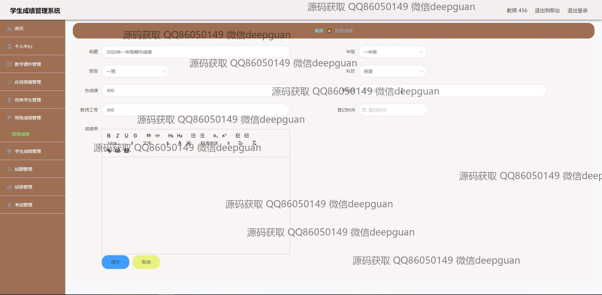
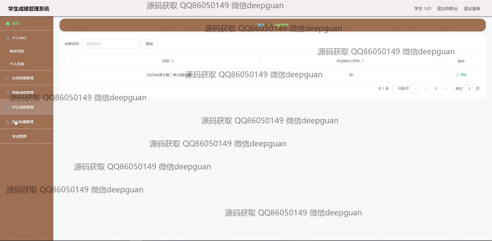
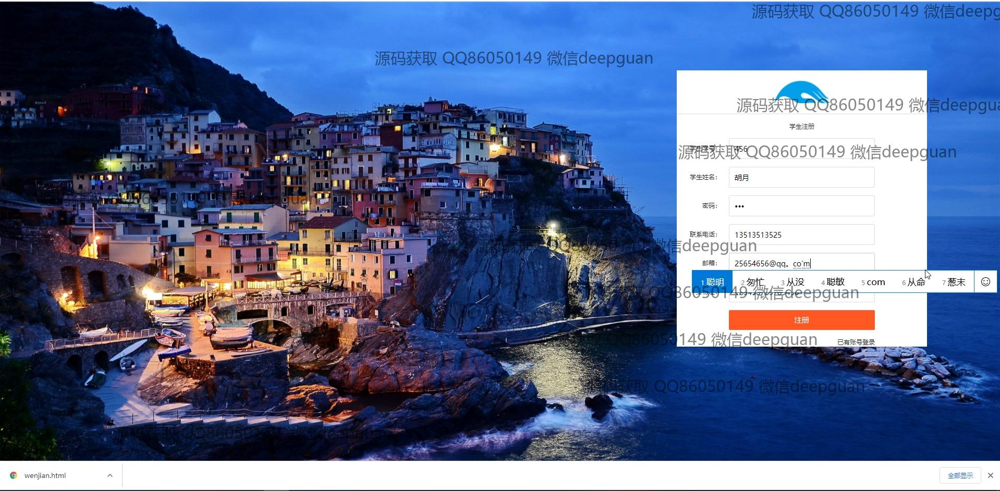
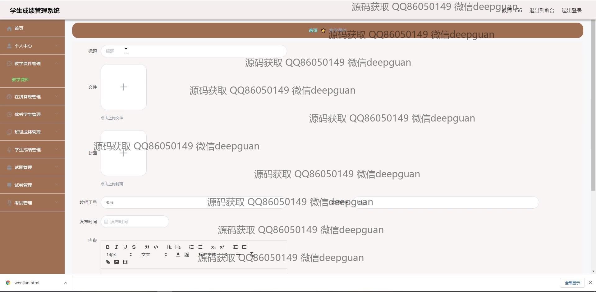

<h1 align="center">vue学生成绩考试课件管理系统</h1>

## 简介
学生成绩考试课件管理系统：角色分为管理员、学生、教师；功能包括学生管理、教师管理、成绩管理、在线答题、试题管理、教学课件管理、公告信息发布、优秀学生与教师管理、注册与登录功能。    --计算机毕业设计源码；毕设源码；java毕业设计源码

## 联系方式

<h3 align="center">获取完整代码与数据库文件 + 微信：deepguan QQ: 86050149 QQ群: 783742310</h3>

<h3 align="center">可帮忙远程部署 包运行成功！提供远程部署、修改代码、设计文档指导、代码讲解等服务！</h3>

## 功能介绍（完整见运行截图）
管理员：提供登录、注册、退出功能，管理模块包括学生管理、教师管理、优秀学生及教师管理、成绩管理、班级成绩管理、试题和试卷管理等。支持教学资源如教学课件、学校简介、公告信息的新增、修改、删除操作，提供系统设置和导航管理，确保系统运行与数据维护。

教师：可登录查看个人信息，管理课程和学生成绩，录入或修改试题、试卷内容，设置题型及分值，提供试题分析功能。支持优秀学生信息、优秀教师信息的审核与发布，在线管理课件和公告资源。

学生：可注册和登录系统，查看个人成绩、班级成绩及排名信息，参与在线考试或答题，上传作业与个人资料，利用系统留言功能与教师沟通，查看教学资源和公告内容。

访客：无需注册即可浏览系统公告、学校简介、优秀师生及教学课件概览，有限访问教学资源与政策信息。

## 运行截图

本代码来源于网络,仅供学习参考使用!

